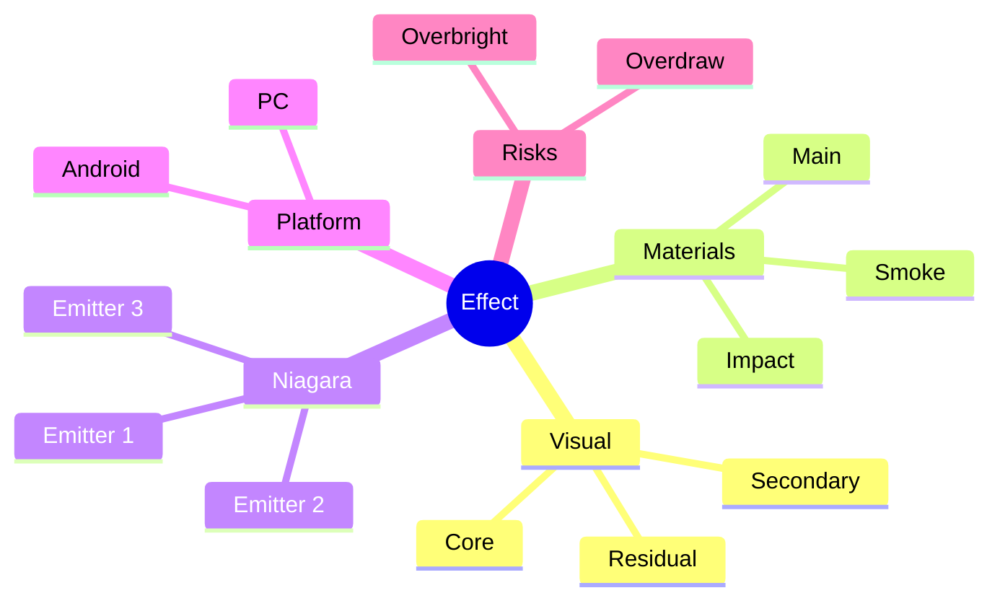

# 参考图 / 视频分析输出规范

## 用途

这份文档用于规定：当用户上传图片、视频、设计图或关键帧时，AI 应该输出什么样的完整分析结果。

目标不是只回答“怎么做”，而是输出一份接近可执行方案的交付包。

---

## 目录

1. 适用输入
2. 必须输出的结果
3. 思维导图要求
4. 流程配图要求
5. 具体实现路径要求
6. 最终效果说明要求
7. 推荐输出顺序

---

## 1. 适用输入

适用这些输入：
- 单张参考图
- 概念设计图
- UI 标注图
- 一组关键帧截图
- 视频拆帧

如果是视频，最推荐：
- 关键帧截图
- 或按阶段拆成几张图

这样更容易分析：
- 起始
- 峰值
- 扩散
- 消散

---

## 2. 必须输出的结果

当用户提供参考后，最终输出里应尽量包含这些内容：

1. 视觉分析
2. 分层拆解
3. 设计图本地缓存路径
4. 图像证据表
5. 材质建议
6. Niagara 结构
7. Emitter 数量和职责
8. 平台版本建议
9. 思维导图
10. 流程配图建议
11. 具体实现路径
12. 最终效果预期说明
13. 纹理资产计划
14. 可直接给外部 AI 的纹理提示词

如果用户只要简版，可以缩短；但只要用户想深入，就应该尽量给全。

### 设计图缓存要求

如果用户给的是设计图、参考图、概念图或关键帧图，先把它缓存到本地，作为后续锚定生图和复盘分析的基础。

推荐路径：

```text
outputs/reference-cache/<effect-name>/design-reference.png
```

如果当前运行环境无法直接取得聊天图片的本地路径，必须先说明需要用户提供本地路径或重新上传文件。不要在没有本地锚点的情况下继续生成纹理、概念变体或 flipbook。

对明显属于拖尾、残影、Mesh、Ribbon 或模型贴附遮罩的层，先走 `references/effect-layer-production-gate.md` 的单层预览闸门，再进入纹理资产计划。

### 图像证据表

分层拆解必须有一张“肉眼观察证据表”。每一层都要对应到设计图里的具体可见区域，而不是只引用图片文字。

推荐列：

```text
层名 | 对应视角/编号 | 图中位置 | 可见形状 | 亮度/颜色 | 材质/纹理证据 | 动势证据 | UE 实现层
```

观察重点：

- 正面、侧面、背面、俯视、前 45 度、后 45 度之间是否一致
- 主轮廓在哪里最强
- 高光从哪里开始，在哪里衰减
- 残影是沿骨骼结构、翼尖路径、尾部轨迹，还是相机方向展开
- 小粒子是稀疏点、金屑带、云纹条，还是亮线断裂
- 哪些细节是模型材质，哪些是 Niagara 残留，哪些只是环境反射或镜头后期

---

## 3. 思维导图要求

分析参考图后，应该尽量生成一个思维导图，把特效结构清晰展开。

推荐用 Mermaid mindmap 或 flowchart。

### 思维导图内容建议

- 目标效果名称
- 主体视觉层
- 次级视觉层
- 材质层
- Niagara Emitter 层
- 平台分版本
- 风险点

### 推荐结构



### 原则

- 不要只画概念图，要和实现结构对应
- 节点命名尽量能映射到最终 Emitter / Material

---

## 4. 流程配图要求

你提到“给每个流程配图”，这里最现实可行的做法是：

### 方式 A：流程阶段配示意图建议

当不能直接生成图时，至少要给出每一步应该配什么图。

例如：
- 图 1：整体视觉分层示意
- 图 2：Emitter 结构图
- 图 3：材质节点关系示意
- 图 4：时间轴阶段图
- 图 5：PC / Android 对比图

### 方式 B：如果环境允许，再配草图 / 示意图描述

可以明确告诉后续该配什么样的图：
- 爆发峰值示意
- 冲击扩散示意
- 烟雾残留示意
- 材质节点结构示意

### 每个流程至少建议配这些图

#### 流程 1：视觉拆层
- 配图：主层 / 次层 / 残留层分色示意

#### 流程 2：Niagara 结构
- 配图：System 与多个 Emitter 的关系图

#### 流程 3：材质实现
- 配图：材质节点块状结构图

#### 流程 4：时序节奏
- 配图：0.0 - 1.0 生命周期关键帧图

#### 流程 5：平台分版本
- 配图：PC 版与 Android 版层级删减对比图

---

## 5. 具体实现路径要求

最终必须给出“从零开始怎么做”的路径，而不是只给概念。

### 推荐写法

#### 第一步：先做哪个 Emitter

例如：
- 先做主体火球
- 再做冲击环
- 再做火星
- 最后补烟雾

#### 第二步：每个 Emitter 用什么 Renderer

例如：
- Emitter 1: Sprite Renderer
- Emitter 2: Ribbon Renderer
- Emitter 3: Mesh Renderer

#### 第三步：每个 Emitter 的关键模块

例如：
- Spawn Burst Instantaneous
- Initialize Particle
- Scale Color
- Solve Forces and Velocity
- Drag
- Curl Noise Force

#### 第四步：每个 Emitter 需要什么材质

例如：
- `M_FX_CoreExplosion`
- `M_FX_ShockRing`
- `M_FX_SmokeSoft`

#### 第五步：先做哪个版本

推荐默认：
- 先做 PC 主版本
- 再做 Android 减法版

#### 第六步：纹理资产决策

实现路径里还应明确写出：
- 哪一层需要纹理
- 需要单张图、Flipbook，还是随机格子图集
- 哪些纹理建议外部 AI 生成
- 哪些更适合后续在 UE / DCC 中烘焙

---

## 6. 最终效果说明要求

你提到“最后生成我提供参考的具体实现路径和样子”，这里的“样子”不能只说“像火焰”。

应该尽量写成：

- 核心亮点长什么样
- 边缘轮廓长什么样
- 动势怎么变化
- 生命周期各阶段看起来像什么
- PC 与 Android 视觉差异是什么

### 推荐表达方式

#### 整体样子
- 整体看上去是一个高亮核心 + 外扩冲击 + 尾部烟雾的爆炸

#### 峰值样子
- 峰值时中心白黄爆亮，外围橙红破边，冲击环在边缘快速打开

#### 消散样子
- 后段亮度快速退下去，只保留轻烟和少量火星

#### 低配样子
- Android 版保留核心爆点和简化冲击环，烟雾更少、细节更薄

---

## 7. 推荐输出顺序

当用户上传参考图或视频后，推荐按这个顺序输出：

1. 视觉分析
2. 本地缓存路径
3. 可行性判断
4. 分层拆解
5. 图像证据表
6. 材质建议
7. Niagara 结构
8. Emitter 数量和职责
9. 实现路径
10. 思维导图
11. 流程配图建议
12. 纹理资产计划
13. AI 纹理提示词
14. 最终效果预期

---

## 一句话原则

不是只告诉用户“它由什么组成”，而是要告诉用户：

它为什么这样拆、该怎么做、先做什么、会长成什么样、低配版怎么落。
